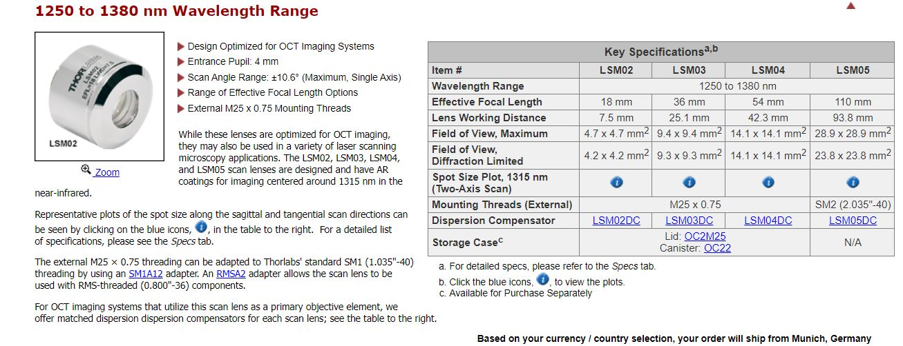

## Compressive OCT for Fast Depth Measurement in Laser Microsurgery

This document describes the use of 3D Optical Coherence Tomography (OCT) for acquiring and segmenting surface details in laser microsurgery. 
The process utilizes ThorLabs' SpectralRadar SDK 5.2 for data capture, which is then exported to MATLAB as CSV files.
A Compressive Depth Map is reconstructed in MATLAB using TVAL3 and compared with a fully scanned depth map for accuracy.

### Usage Instructions

#### MATLAB
- Run `sparseOCTdepth.m`
- The user should input the experimental trial number (`trialNum`) when prompted.
- Note: **Avoid** using `0` as the trial number, as this is the default directory reserved for C++ operations
- Data will be stored in `./data/getDepthFromSparse3Doct/<trialNum>`.

#### C++ (Visual Studio)
- Running the C++ program in Visual Studio will store data in the directory `./data/getDepthFromSparse3Doct/0`

#### C++ Setup
1. [Setting Up C++ on Windows](https://www.youtube.com/watch?v=1OsGXuNA5cc)
2. [Optimal Visual Studio Setup for C++ Projects](https://www.youtube.com/watch?v=qeH9Xv_90KM)
3. [Static Linking of ThorLabs API](https://www.youtube.com/watch?v=or1dAmUO8k0) (Static linking is preferred for speed).
   - ThorLabs API can be found [here](https://gitlab.advr.iit.it/BRL/laser/thorlabs-api).
4. Ensure to build for x64 architecture.
     

Will be updated in the future!

### To Do
1. Abalted contour detection:
  - https://www.cvat.ai/annotation-service
  - https://www.makesense.ai/
  - https://segment-anything.com/

### Known Bugs

1. The first plot in `matlabCustomFunction\calibration.m` is skewed. Running it again resolves this issue.
2. `OCTImageCapture.exe` doesn't generate `scanPatternX.jpg` properly. The X varies each time.

### Auto-CALM Notes
1. `roscore`
2. Make sure black-wire USB cable from CALM control box is connected to laptop.
3. Check the USB devices by running [this script](https://gist.github.com/ajaygunalan/0c7afbe4a931fb4fb3f9de0dd223f763#file-findusbdev-sh) and you should see
 `/dev/ttyACM0 - Teensyduino_USB_Serial_6311670`
4. Integrate CALM with ROS netwrok by
 `rosrun rosserial_python serial_node.py /dev/ttyACM0 _baud =115200`
6. Go to `/home/sli/calm/catkinWs`  and `source /devel/setup.bash`
7. run `rosrun python_pkg final.py`
8. Draw the circle starting from bottom.
9. Go in clockwise driection
10. Make sure feature is clear and backgound is neat.
11. open light
12. density of red spot
6. first turn on calm then connect with usb and check it is moving with pen. if not, it will **vibrate**.

### OCT Lenses
1. [LSM03](https://www.thorlabs.com/thorproduct.cfm?partnumber=LSM03)
2. [LSM04](https://www.thorlabs.com/thorproduct.cfm?partnumber=LSM04)

